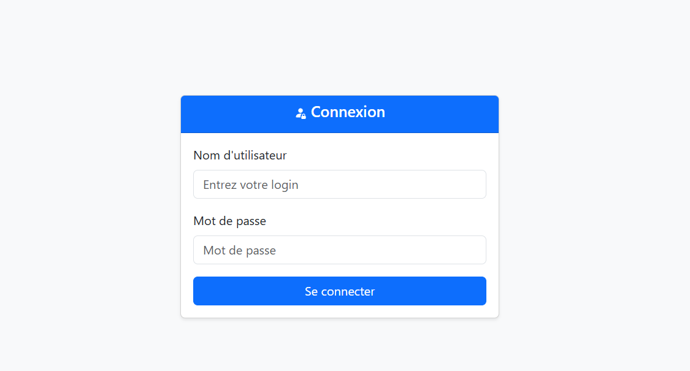
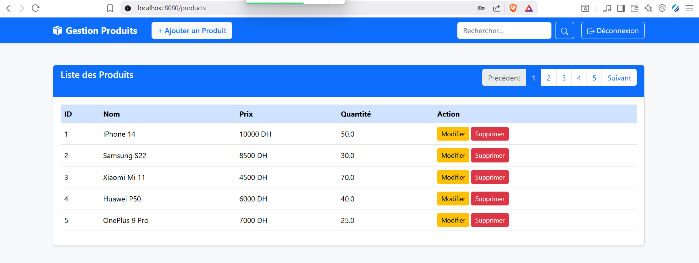
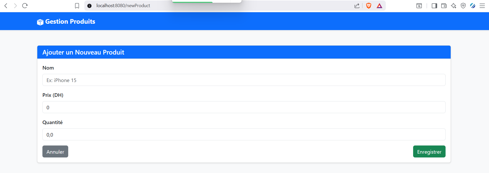
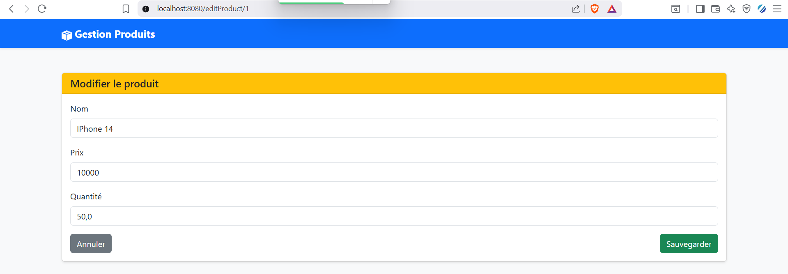

# Gestion des Produits - Spring MVC, Thymeleaf & Spring Security

## 📌 Description
Application web de gestion des produits développée avec **Spring Boot**, **Spring Data JPA**, **Hibernate**, **Thymeleaf** et **Spring Security**.  
Elle permet aux utilisateurs de **consulter, rechercher, ajouter, modifier et supprimer** des produits, avec une pagination pour faciliter la navigation.

---

## 🔧 Fonctionnalités
- Authentification avec **Spring Security** (InMemory)
    - Rôles : `USER` et `ADMIN`
- Gestion des produits :
    - **Lister** tous les produits
    - **Recherche** par nom
    - **Ajouter** un produit (ADMIN)
    - **Modifier / Mettre à jour** un produit (ADMIN)
    - **Supprimer** un produit (ADMIN)
- **Pagination** pour naviguer dans la liste
- Interface responsive et moderne avec **Bootstrap 5**
- Messages et confirmations claires pour l’utilisateur

## 🖼 Captures d’écran
 ### Page de login


### Liste des produits avec pagination


### Ajout d’un produit


### Édition d’un produit


---

## 📂 Structure du projet
    src/
    ├─ main/
    │  ├─ java/
    │  │  └─ ma.enst.iibdcc
    │  │     ├─ controllers/
    │  │     ├─ entites/
    │  │     ├─ repositories/
    │  │     ├─ services/
    │  │     └─ security/
    │  └─ resources/
    │     ├─ templates/
    │     ├─ static/
    │     └─ application.properties

## 💡 Technologies utilisées

- Spring Boot
- Spring MVC
- Spring Data JPA & Hibernate
- Thymeleaf
- Spring Security
- Bootstrap 5
- H2 / MySQL
- Lombok
- 
## ⚙️ Installation et Lancement

1. Cloner le projet :
```bash
git clone https://github.com/HamzaRabih/gestion-produits-springmvc.git
```
2. Importer dans IntelliJ / Eclipse comme projet Maven.
3. Configurer la base de données dans application.properties (H2 ou MySQL) :
```properties
spring.application.name=Spring-MVC-Thymeleaf-Spring-Security
server.port=8080
spring.datasource.url=jdbc:h2:mem:products-db
spring.datasource.username=sa
spring.datasource.password=
spring.jpa.hibernate.ddl-auto=update
#Pour consulter la BDD http://localhost:8080/h2-console/
spring.h2.console.enabled=true
```
4. Lancer l’application 
5. Accéder à l’application : http://localhost:8080/
6. 
## 👤 Comptes de test
| Utilisateur | Mot de passe | Rôle       |
| ----------- | ------------ | ---------- |
| user        | 1234         | USER       |
| admin       | admin        | ADMIN,USER |

---
## 📌 Auteur
Hamza Rabih – Master 1 II-BDCC – ENSET